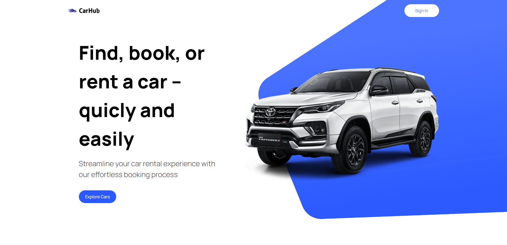
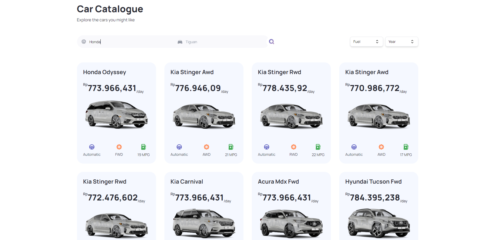
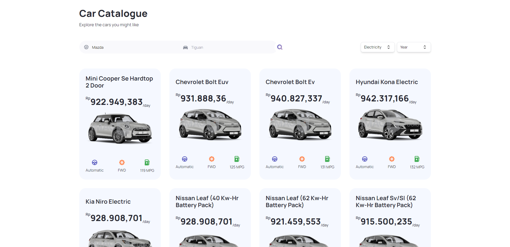
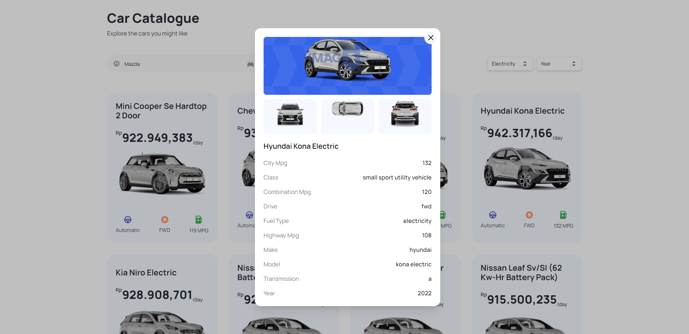

# Car Hub 

## Contents

- [Description](#description)
- [Features](#features)
- [Installation](#installation-for-development)
- [Screenshoots](#screenshoots)
- [Demo Car Hub](#demo-car-hub)

## Description

**Car Hub** is a website built to facilitate users in obtaining specifications for rental cars. Car Hub fetches details about cars from an external API with search functionality, search filters, and search input. It is created with both client-side and server-side rendering.

## Features
- Search Car
- Filter by manufacturer
- Filter by car model
- Filter by fuel
- Filter by year

## Installation for Development

Use the package manager [npm](https://www.npmjs.com/get-npm) to install all required dependecies.
```bash
npm install
```
and then:
```bash
npm run dev
```

## Screenshoots

<div align="center">
    
    
    
    
</div>

## Demo Car Hub

Let's try it.

<a href="https://car-showcase-3wg9.vercel.app/" target="_blank">
  
</a>

